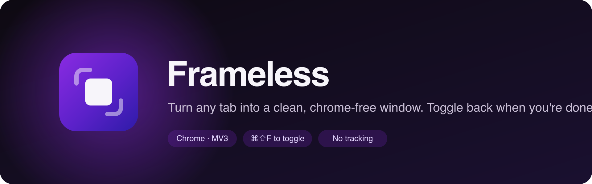

<p align="center">
  
</p>

<p align="center">
  <a href="https://github.com/adammmmmm/frameless/releases"></a>
  
  <a href="./LICENSE"></a>
</p>

**Frameless** turns the current tab into a clean popup window with no tab strip, address bar, or bookmarks. Toggle again and the tab goes back where it came from. The page keeps its state either way.

<p align="center">
  
</p>

## Install

**From a release (no build step)**

1. Download `frameless-v*-unpacked.zip` from [Releases](https://github.com/adammmmmm/frameless/releases) and extract it.
2. Open `chrome://extensions`, turn on **Developer mode**, and click **Load unpacked**.
3. Select the extracted `frameless` folder.

<details>
<summary><b>From source</b></summary>

```bash
git clone https://github.com/adammmmmm/frameless.git
cd frameless
npm install
npm run build
```

Then load the repo folder with **Load unpacked** as above. `npm run pack` writes the release zip to `dist/`.

</details>

## Use

Any of these toggles the active tab:

- Click the Frameless icon in the toolbar.
- Right-click the page and choose **Toggle Frameless**.
- Press <kbd>⌘</kbd><kbd>⇧</kbd><kbd>F</kbd> on macOS or <kbd>Ctrl</kbd><kbd>Shift</kbd><kbd>F</kbd> on Windows and Linux. Change it at `chrome://extensions/shortcuts`.

The toolbar badge shows **ON** while a tab is frameless.

## How it works

| | |
| --- | --- |
| **Focus** | The live tab is moved into a new popup window, so page state, scroll position, and form input are preserved. |
| **Restore** | The tab moves back to the window it came from. If that window is gone, it goes to the first normal window, or a new one. |
| **Fallback** | If Chrome refuses to move the tab, Frameless opens the URL in a fresh window and closes the old tab. Page state can be lost in this case, and a warning is logged to the service worker console. |
| **Restricted pages** | Nothing happens on `chrome://`, `edge://`, `about:`, the Web Store, or extension pages. |

Frameless remembers which window each tab came from in `chrome.storage.session`, which Chrome clears when the browser closes.

## Permissions

| Permission | Used for |
| --- | --- |
| `tabs` | Reading the tab's URL and window, and moving it between windows |
| `contextMenus` | The right-click toggle |
| `storage` | Remembering each tab's origin window for the session |

No host permissions. No network access. No analytics.

## Limits

- Chrome has no API to hide its UI on a single tab, so Frameless uses popup windows. This is the closest Chrome allows.
- Fullscreen, picture-in-picture, and hiding site-specific UI are out of scope.
- The fallback path reloads the page and can drop single-page-app or form state. It only runs when the normal move fails.

## Develop

```bash
npm install
npm run build      # bundle the service worker and tests with esbuild
npm run typecheck  # tsc --noEmit
npm test           # unit tests for the URL policy
npm run verify     # typecheck + test
```

Source is TypeScript in `src/`. The service worker entry is `src/background.ts`, bundled to `background.js`. Brand assets live in `src/images/brand/`.

## License

[MIT](./LICENSE)
